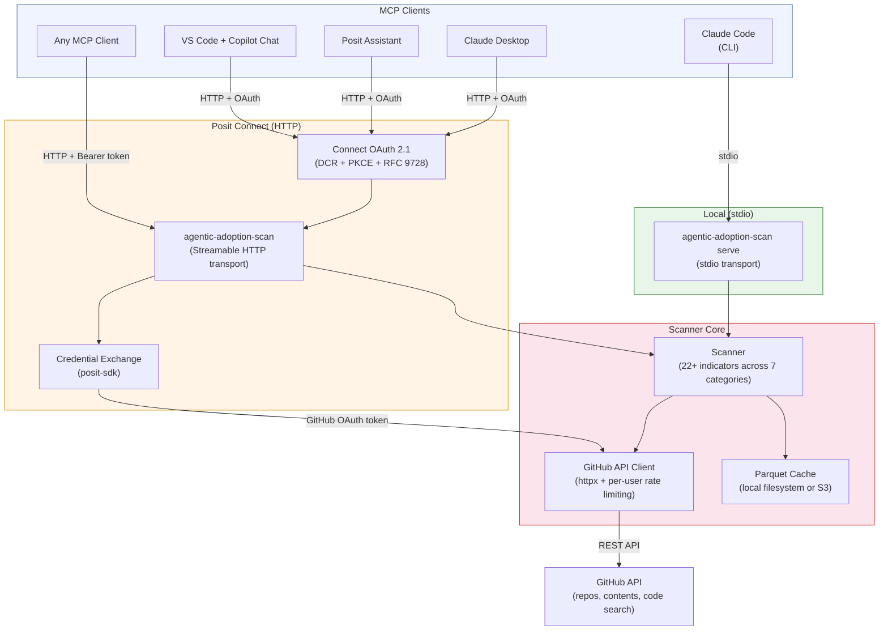

# eng-effectiveness-metrics-tools

Tools for measuring and tracking engineering effectiveness, with a focus on agentic coding tool adoption.

---

## agentic-adoption-scan

A CLI tool and MCP server that scans all repositories in a GitHub organization to detect adoption of agentic coding tools (Claude Code, GitHub Copilot, Cursor, MCP servers, evals frameworks, and more). Produces tidy-format CSV or Parquet data suitable for analysis and visualization.

### Architecture



**Two deployment modes:**

- **Local (stdio):** Claude Code launches the server as a subprocess. Authentication uses your local `GH_TOKEN` / `GITHUB_TOKEN` environment variable. No network server needed.
- **Posit Connect (HTTP):** The server runs as an ASGI app behind Connect's OAuth 2.1 layer. Each user authenticates through Connect, and their GitHub token is obtained via Connect's credential exchange API — no shared tokens.

Both modes use the same scanner core: the GitHub API client, indicator matching, and Parquet cache.

### Install

```bash
pip install agentic-adoption-scan
```

Or with S3 cache support:

```bash
pip install "agentic-adoption-scan[s3]"
```

### Prerequisites

The tool requires a GitHub personal access token (PAT) for API access. Set it as an environment variable:

```bash
export GITHUB_TOKEN=<your-github-pat>
```

The token needs `repo` scope (or fine-grained equivalent) to read repository contents and code search results. You can also use `GH_TOKEN` (checked first) as an alternative environment variable name.

### Usage

**Scan an organization for agentic tool indicators:**

```bash
agentic-adoption-scan scan --org your-org --output results.csv
```

**Fetch and analyze content of detected indicators:**

```bash
agentic-adoption-scan inspect --org your-org --scan-results results.csv --output inspect-results.csv
```

**Generate a customizable indicators config file:**

```bash
agentic-adoption-scan init-config --output indicators.yaml
```

**Run as an MCP server for Claude Code integration:**

```bash
agentic-adoption-scan serve
```

### Scan flags

| Flag | Default | Description |
|------|---------|-------------|
| `--org` | (required) | GitHub organization to scan |
| `--output` | stdout | Output file path |
| `--format` | csv | Output format: `csv` or `parquet` |
| `--days` | 90 | Only include repos active in the last N days |
| `--include-archived` | false | Include archived repos |
| `--force` | false | Bypass cache and rescan everything |
| `--cache-dir` | `.agentic-scan-cache` | Directory (or `s3://` URL) for scan state cache |
| `--config` | | Path to custom indicators YAML config |
| `--verbose` | false | Enable verbose logging |

### What it detects

The tool checks for 25+ built-in indicators across 7 categories:

| Category | Examples |
|----------|---------|
| `claude-code` | `CLAUDE.md`, `.claude/` directory, `settings.json`, custom commands |
| `github-copilot` | `copilot-instructions.md`, `.copilot/` directory |
| `cursor` | `.cursorrules`, `.cursor/rules/` directory |
| `agents-config` | `AGENTS.md`, `.agents/` directory |
| `mcp` | `mcp.json`, `.mcp.json`, MCP server configs |
| `evals` | evals directories, promptfoo, inspect\_ai, mcp-evals |
| `workflows-ai` | claude-code-action, Copilot references, AI review actions |

You can extend or override these indicators via a YAML config file (`init-config` generates a starter).

### Output format

Scan results are written as tidy CSV — one row per (repo × indicator) observation:

```
scan_timestamp,org,repo,repo_visibility,repo_language,repo_pushed_at,category,indicator,found,file_path,details
```

This format makes it easy to filter, pivot, and visualize in R, Python, or any BI tool.

### MCP server

The tool can run as an MCP server, exposing tools for use directly within Claude Code:

```json
{
  "mcpServers": {
    "agentic-adoption-scan": {
      "command": "agentic-adoption-scan",
      "args": ["serve"]
    }
  }
}
```

Available MCP tools: `scan_org`, `inspect_repo`, `list_indicators`, `get_repo_summary`, `get_adoption_summary`.

#### Per-user authentication (HTTP transport)

When running over the HTTP transport (`serve --transport http`), the server supports per-user GitHub tokens. The token is extracted transparently from the request — no tool parameter is needed. The server reads, in order:

1. `Authorization: Bearer <token>` header (standalone HTTP deployments)
2. `Posit-Connect-User-Session-Token` header, exchanged for a GitHub OAuth token via `posit-sdk` (Connect deployments with viewer OAuth)
3. `GH_TOKEN` / `GITHUB_TOKEN` environment variable (fallback for stdio or unauthenticated requests)

This enables multi-user deployments where each user authenticates with their own GitHub credentials without any changes to tool calls.

### Deploying to Posit Connect

You can deploy the MCP server to [Posit Connect](https://docs.posit.co/connect/user/mcp-servers/) so that AI clients across your organization can access it without running anything locally. The `connect/` directory contains the ASGI entrypoint for Connect's runtime.

#### Prerequisites

- [rsconnect-python](https://docs.posit.co/rsconnect-python/) installed: `pip install rsconnect-python`
- A Posit Connect server URL and API key

#### 1. Set environment variables

In your Connect content's **Vars** settings (or pass via `--environment` at deploy time), set:

```
GITHUB_TOKEN=<your-github-pat>
```

#### 2. Write the manifest

```bash
cd connect/
rsconnect write-manifest fastapi --overwrite --entrypoint server:app .
```

#### 3. Deploy

```bash
rsconnect deploy fastapi \
  --server https://your-connect-server.example.com \
  --api-key YOUR_API_KEY \
  --entrypoint server:app \
  --title "agentic-adoption-scan" \
  .
```

#### 4. Use from Claude Code

Once deployed, add the Connect-hosted MCP server to your Claude Code configuration:

```json
{
  "mcpServers": {
    "agentic-adoption-scan": {
      "type": "streamable-http",
      "url": "https://your-connect-server.example.com/content/<content-id>/mcp"
    }
  }
}
```

#### Performance tip

Set **Min processes** to `1` in the content's runtime settings so the server is always warm and avoids cold-start delays when clients connect.

---

## Other scripts

**Record a deployment event into GitHub:**

```bash
./record-deployment.sh posit-dev/eng-effectiveness-metrics-tools main testing
```

---

## Releases

Releases are fully automated via [python-semantic-release](https://python-semantic-release.readthedocs.io/) on every merge to `main`. The version bump is determined automatically from [Conventional Commit](https://www.conventionalcommits.org/) PR titles (enforced by the `pr-title` workflow):

| PR title prefix | Version bump |
|---|---|
| `fix:` | patch — `0.1.0` → `0.1.1` |
| `feat:` | minor — `0.1.1` → `0.2.0` |
| `feat!:` / `BREAKING CHANGE:` | major — `0.2.0` → `1.0.0` |
| `chore:`, `docs:`, `refactor:`, etc. | no release |

On every merge to `main`, semantic-release analyzes commits since the last tag. If there are releasable changes, it creates a `CHANGELOG.md` entry, commits it, tags the new version (e.g. `v0.2.0`), and publishes a GitHub release. The new tag then triggers the `publish.yml` workflow, which builds the package and publishes it to PyPI.

### One-time setup required

**Deploy key** — semantic-release pushes back to `main` and needs to trigger the publish workflow. The default `GITHUB_TOKEN` cannot do this, so an SSH deploy key is required:

```bash
ssh-keygen -t ed25519 -C "semantic-release" -f deploy_key -N ""
```

1. Add `deploy_key.pub` as a repo **Deploy key** with write access: _Settings → Deploy keys_
2. Add `deploy_key` (private) as an Actions secret named **`DEPLOY_KEY`**: _Settings → Secrets and variables → Actions_

**PyPI Trusted Publisher** — the publish workflow uses [OIDC Trusted Publishing](https://docs.pypi.org/trusted-publishers/) (no API token needed). Configure a Trusted Publisher on PyPI for this repository pointing to the `publish.yml` workflow and the `pypi` environment.
